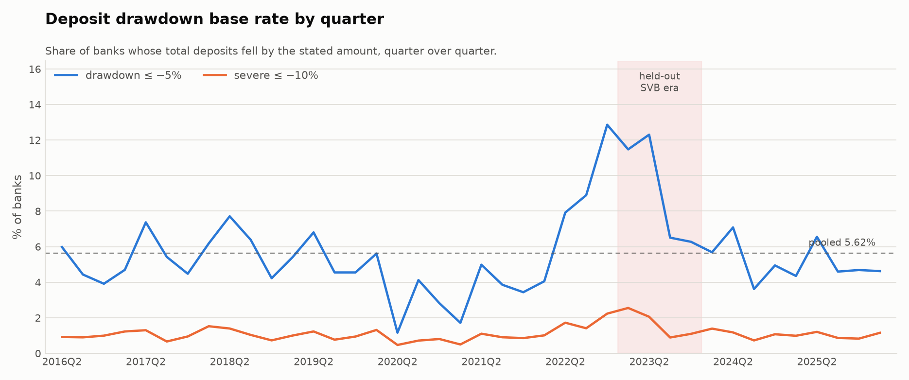
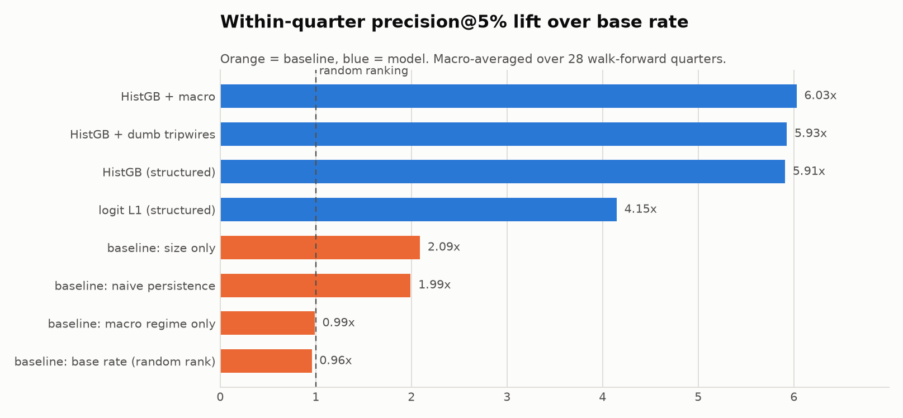
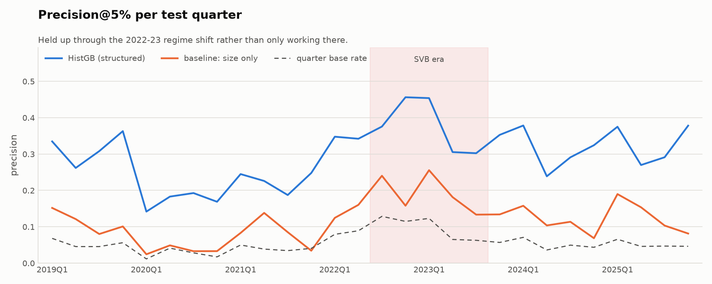
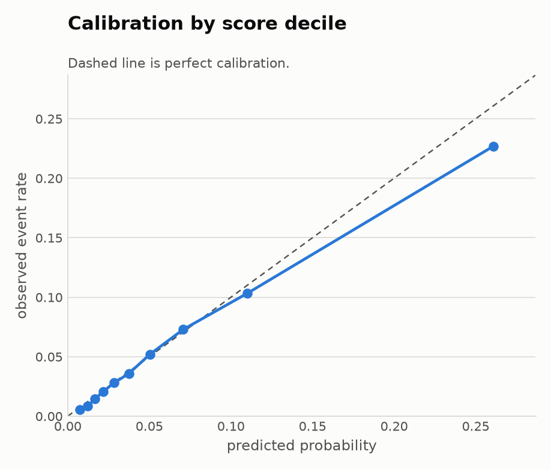
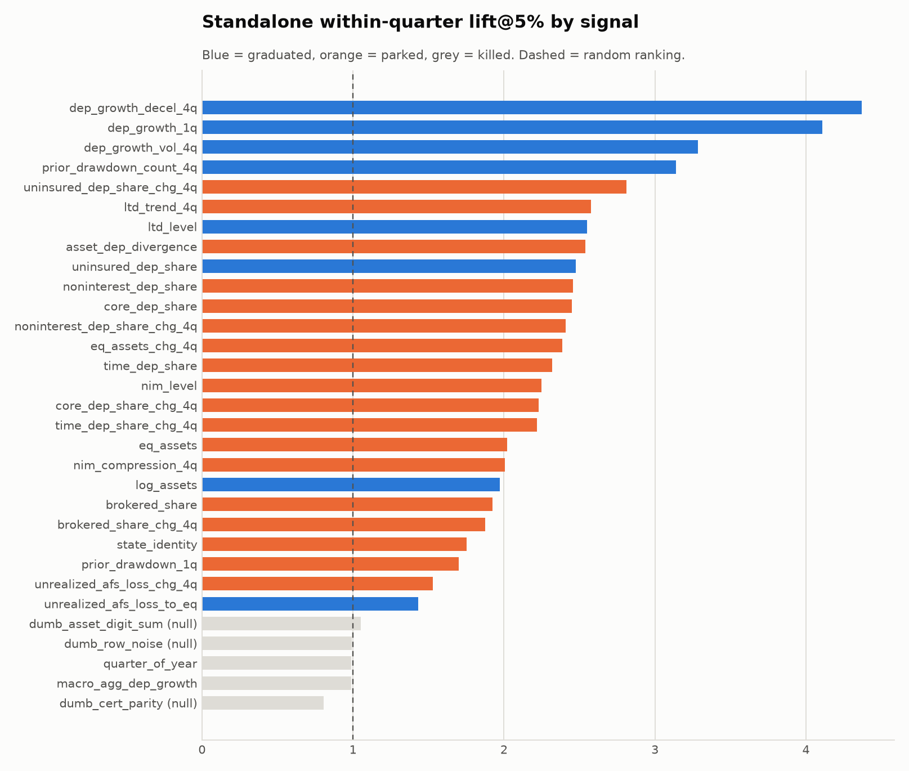

# drawdown-radar

**Which banks will lose a meaningful chunk of their deposits next quarter — and how much to trust the answer.**

A signal system, not an analysis. Candidate leading indicators live in a registry, get
backtested against known outcomes with a strict walk-forward protocol, and are then
**graduated, parked, or killed** by preregistered rules. Scorecards and the table below are
generated from the registry, never hand-edited.

Public analog for "which customers will pull their treasury balance next quarter", built on
FDIC Call Report data for every US bank, 2015Q1–2026Q1.

---

## The 10-line version

Each quarter, this ranks ~4,350 US banks by their probability of a ≥5% deposit decline in the
**following** quarter, using only what was observable at the time.

- If you can work **~50 alerts a quarter**, about **46%** of them are real drawdowns.
  The base rate is **5.6%**, so that is **9.4× better than random**.
- At a wider **top 5%** (~230 banks), precision is **29.8%** and it catches **29.6%** of all
  drawdowns that quarter.
- Alerts are ranked **within size bands**, because an unstratified list is a small-bank list —
  3,287 of 4,352 banks are under $1B, and the names that matter would never surface.
- Trained only on pre-2022 data and pointed at the SVB era it had never seen, precision@1%
  was **53%** (3.8× lift). It degrades, and the degradation is quantified below.
- The strongest signals are **deposit growth deceleration**, **loan-to-deposit level**, and
  **uninsured deposit share** — the last one available back to 2015, which is what makes
  "would this have flagged 2023 in advance?" answerable at all.

Sample of the real output (`drawdown-radar score --quarter 2026Q1`):

| Bank | Size band | Deposits | Score | Pctile | Why |
|---|---|---|---|---|---|
| BANK OF NEW YORK MELLON | >$10B | $419.7B | 0.709 | 100.0 | deposits jumped 26.3% last quarter, and lumpy inflows tend to leave again; the bank holds about $467.3B in assets; operational balances grew 13.4% as a share of the book over the year |
| MONET BANK | $1B–$10B | $947.3M | 0.666 | 100.0 | uninsured share rose 55.0% over the year; core deposit share rose 32.9% over the year; capital ratio rose 11.9% over the year |
| SOUTHPOINT BANK | $1B–$10B | $1,318.7M | 0.597 | 99.9 | core deposits are only 61.5% of the book; deposits already fell 8.2% last quarter; unrealized securities losses equal 8.4% of equity |
| FMB BANK | <$1B | $49.5M | 0.766 | 100.0 | operational balances grew 48.5% as a share of the book over the year; deposit growth accelerated 40.5% versus its own trailing year; deposits jumped 33.0% last quarter |

50 alerts per quarter: 25 under $1B, 15 in $1B–$10B, 10 above $10B. 118 of 4,352 banks are
excluded from scoring by the same filters used in training.

Full list: [`reports/alerts_2026Q1.csv`](reports/alerts_2026Q1.csv) ·
[`reports/alerts_2026Q1.json`](reports/alerts_2026Q1.json)

**What this is not.** Bank-level ≠ account-level, quarterly ≠ daily, and a public Call Report
is a much blunter instrument than a warehouse of daily balances. See
[Limitations](#limitations) — it is not a formality section.

---

## Quickstart

```bash
make setup                      # venv + install
drawdown-radar pull             # fetch + cache FDIC data to data/raw/ (re-runs offline)
drawdown-radar build            # labels, exclusion audit, as-of audit, base rates, figures
drawdown-radar backtest         # baselines, models, leakage checks, out-of-time, ablations
drawdown-radar scorecards       # regenerate graduation scorecards from the registry
drawdown-radar score --quarter 2026Q1
```

---

## Event definition

For bank *i* at quarter *T*, using total deposits (`DEP`):

```
label(i,T) = 1  if  (DEP[i,T+1] - DEP[i,T]) / DEP[i,T]  <=  -5%     # primary
severe(i,T) = 1 if  the same ratio <= -10%                          # secondary tier
```

The label attaches to the feature row at **T** and describes **T+1**, so every model predicts
one quarter ahead from information already published.

**Base rate: 5.62%** primary (11,027 events), **1.11%** severe (2,169), across 196,150
bank-quarters and 6,025 banks, 2016Q1–2025Q4.

<picture>
  <source media="(prefers-color-scheme: dark)" srcset="reports/figures/base_rate_dark.png">
  
</picture>

The regime swamps everything: **12.86%** in 2022Q4 against **1.16%** in 2020Q2, when COVID
stimulus flooded deposits in. That single fact dictates the choice of headline metric below.

### Exclusions — 83.1% of raw rows retained

A bank that vanishes is not a drawdown; absence of a T+1 row makes the label *undefined*, not
zero. Every rule is counted, and the count is generated
([`reports/exclusion_audit.csv`](reports/exclusion_audit.csv)):

| Rule | Rows removed |
|---|---|
| Foreign-branch charter (`BKCLASS` in NC/OI) | 3,119 |
| No T+1 row (bank exited, or end of panel) | 6,497 |
| Deposits < $10M at T (degenerate base) | 1,887 |
| Deposits < $10M at T+1 (terminal wind-down) | 64 |
| Intra-holding-company charter consolidation | 1,670 |
| Fewer than 5 quarterly observations | 24,693 |
| De novo (< 8 quarters old at T) | 262 |
| Absorbed another bank in T+1 (inorganic jump) | 1,668 |
| Hand-adjudicated structure events | 6 |
| **Retained** | **196,150** |

Mid-panel disappearances break down as 2,072 acquired (successor in `NEWCERT`), 139 exited with
no successor, 27 with no exit record. Consistency check: 6,497 terminal rows − 2,238 mid-panel
exits = 4,352 = exactly the 2026Q1 bank count.

---

## Why the headline metric is *within-quarter* precision@k

Because the base rate moves 11× across the panel, **any feature correlated with the macro cycle
lets a model score well by inferring which quarter it is.** Pooled AUC and PR-AUC reward that.
Ranking banks *inside* a quarter cannot — and "given this quarter's book, who do we call?" is
the actual question, since an alert list is worked within a quarter.

Two independent measurements of how much pooled metrics inflate:

1. **A macro-only baseline** (aggregate system deposit growth, constant within a quarter) has
   within-quarter AUC of **0.5000** and lift **0.99** — literally zero ability to rank banks,
   as guaranteed by construction. Its **pooled** AUC is **0.587** and pooled PR-AUC **1.27×**
   the base rate.
2. **The shuffled-label test** destroys all real signal, yet pooled PR-AUC still reads
   **0.0745** against a base rate of 0.0568 — a 1.31× "lift" **on pure noise**.

Pooled numbers are reported throughout, labelled `INFLATED`. They are context, not the result.

---

## Results

Walk-forward, expanding window, 28 test quarters (2019Q1–2025Q4). Base rate over the test
window: **5.68%**.

| Model | prec@1% | lift@1% | prec@5% | recall@5% | lift@5% | AUC within-quarter | pooled AUC *(inflated)* |
|---|---|---|---|---|---|---|---|
| baseline: base rate (random rank) | 0.049 | 0.92 | 0.055 | 0.048 | 0.96 | 0.501 | 0.503 |
| baseline: naive persistence | 0.169 | 3.49 | 0.107 | 0.100 | 1.99 | 0.406 | 0.442 |
| baseline: size only | 0.133 | 2.31 | 0.118 | 0.105 | 2.09 | 0.575 | 0.576 |
| baseline: macro regime only | 0.048 | 0.83 | 0.057 | 0.050 | 0.99 | **0.500** | 0.587 |
| logit L1 (structured) | 0.275 | 5.82 | 0.209 | 0.208 | 4.15 | 0.725 | 0.722 |
| **HistGB (structured)** | **0.456** | **9.37** | **0.298** | **0.296** | **5.91** | **0.805** | 0.791 |
| HistGB + macro | 0.455 | 9.41 | 0.304 | 0.302 | 6.03 | 0.809 | 0.790 |
| HistGB + null tripwires | 0.452 | 9.23 | 0.300 | 0.297 | 5.93 | 0.805 | 0.791 |

<picture>
  <source media="(prefers-color-scheme: dark)" srcset="reports/figures/model_comparison_dark.png">
  
</picture>

**Gradient boosting beats the linear model decisively**, not marginally: 0.298 vs 0.209
precision@5%, 0.805 vs 0.725 AUC. That is not a free lunch — [the U-shape
below](#the-relationship-is-u-shaped-which-is-why-the-linear-model-loses) explains exactly
which structure the linear model cannot represent.

**Knowing the macro regime adds almost nothing** once the book is in the model (6.03 vs 5.91
lift). The bank's own funding structure already encodes the cycle.

### Stability across quarters

<picture>
  <source media="(prefers-color-scheme: dark)" srcset="reports/figures/precision_per_quarter_dark.png">
  
</picture>

### By size band — the model must beat size *inside* strata

An unstratified top-50 is a small-bank list. Each band gets its own quota and its own
percentile, so >$10B names actually surface. `mean k` is alerts per quarter in that band.

| Size band | mean k | random | size-only | persistence | **HistGB** |
|---|---|---|---|---|---|
| <$1B | 185.9 | 0.060 *(1.02×)* | 0.121 *(2.02×)* | 0.106 *(1.92×)* | **0.306** *(5.83×)* |
| $1B–$10B | 39.3 | 0.038 *(0.78×)* | 0.057 *(1.07×)* | 0.102 *(2.41×)* | **0.257** *(6.37×)* |
| >$10B | 7.8 | 0.040 *(0.49×)* | 0.096 *(2.83×)* | 0.179 *(4.03×)* | **0.283** *(7.21×)* |

Note the `$1B–$10B` column: size-only lift is **1.07**, i.e. size does essentially no work
inside that band, while the model gets 6.37×. Lift is *highest* in `>$10B` (7.21×) — the band
containing the events anyone actually cares about. Caveat: at k=1% the >$10B band is ~1.6
alerts per quarter, too thin to read as a stable estimate.

### Out-of-time: the SVB era

Trained **only** on `T ≤ 2021Q3`, then pointed at events in 2022Q4–2023Q4 with no refitting.
Base rate in that window is 9.90%.

| Model | prec@1% | lift@1% | prec@5% | lift@5% | AUC within-quarter |
|---|---|---|---|---|---|
| **HistGB (structured)** | **0.532** | **5.76** | **0.363** | **3.84** | **0.734** |
| logit L1 | 0.157 | 1.59 | 0.150 | 1.56 | 0.615 |
| baseline: size only | 0.196 | 2.05 | 0.194 | 2.05 | 0.589 |
| baseline: persistence | 0.227 | 2.34 | 0.165 | 1.66 | 0.451 |

Honest read: HistGB degrades (AUC 0.805 → 0.734, lift 5.91 → 3.84) but still clears every
baseline by a wide margin. **The linear model does not survive the regime change at all** —
lift 1.56, *worse than the size-only baseline*. A rate cycle it had never seen broke its
coefficients; the tree-based model's ordinal splits held.

### Severity tiers

| Tier | base rate | events | prec@1% | lift@1% | prec@5% | lift@5% | AUC within-quarter |
|---|---|---|---|---|---|---|---|
| primary ≤ −5% | 5.68% | 7,366 | 0.456 | 9.37 | 0.298 | 5.91 | 0.805 |
| severe ≤ −10% | 1.13% | 1,471 | 0.285 | 26.92 | 0.126 | 11.67 | 0.908 |

−5% stays primary: at 1.11% the severe tier gives ~2,100 events over 40 quarters, too thin for
stable walk-forward evaluation. Cross-threshold consistency is good — a score trained on −5%
ranks −10% events with AUC **0.901** and lift 24.0 at k=1%, so the graduated signals are
reading funding fragility rather than one threshold. Per-signal severe-tier lift is a column in
the scorecards.

### Calibration

<picture>
  <source media="(prefers-color-scheme: dark)" srcset="reports/figures/calibration_dark.png">
  
</picture>

Deciles track the diagonal closely; the top decile is mildly **over**confident (predicted
0.261 vs observed 0.227), so treat high scores as ordinal ranks rather than literal
probabilities.

---

## Signal graduation

Verdicts are applied by rule from ablation evidence, against thresholds fixed in `PLAN.md`
before any result was seen. GRADUATE requires incremental lift ≥ 0.05 **and** stability ≥ 70%
of folds. `standalone` = the signal alone; `incremental` = what the full model loses when it is
removed.

<!-- BEGIN:signal-table (generated by `drawdown-radar scorecards`) -->

| Signal | Verdict | Standalone lift@5% | Incremental lift@5% | Stable folds | -10% tier lift |
|---|---|---|---|---|---|
| `ltd_level` | **GRADUATED** | 2.549 | 0.159 | 1.00 | 4.564 |
| `dep_growth_decel_4q` | **GRADUATED** | 4.369 | 0.133 | 1.00 | 7.684 |
| `uninsured_dep_share` | **GRADUATED** | 2.476 | 0.100 | 1.00 | 5.207 |
| `dep_growth_vol_4q` | **GRADUATED** | 3.285 | 0.099 | 1.00 | 7.542 |
| `prior_drawdown_count_4q` | **GRADUATED** | 3.138 | 0.090 | 1.00 | 5.034 |
| `log_assets` | **GRADUATED** | 1.974 | 0.082 | 1.00 | 1.805 |
| `unrealized_afs_loss_to_eq` | **GRADUATED** | 1.433 | 0.072 | 0.89 | 1.644 |
| `dep_growth_1q` | **GRADUATED** | 4.107 | 0.050 | 1.00 | 7.913 |
| `time_dep_share` | PARKED | 2.320 | 0.041 | 0.96 | 4.537 |
| `uninsured_dep_share_chg_4q` | PARKED | 2.813 | 0.034 | 1.00 | 5.022 |
| `eq_assets_chg_4q` | PARKED | 2.388 | 0.017 | 0.93 | 4.287 |
| `core_dep_share` | PARKED | 2.449 | 0.013 | 1.00 | 4.352 |
| `unrealized_afs_loss_chg_4q` | PARKED | 1.528 | 0.009 | 0.86 | 1.747 |
| `ltd_trend_4q` | PARKED | 2.578 | 0.004 | 0.96 | 4.972 |
| `time_dep_share_chg_4q` | PARKED | 2.217 | -0.001 | 0.96 | 3.953 |
| `prior_drawdown_1q` | PARKED | 1.701 | -0.013 | 0.89 | 2.049 |
| `nim_compression_4q` | PARKED | 2.008 | -0.021 | 0.89 | 3.503 |
| `asset_dep_divergence` | PARKED | 2.538 | -0.030 | 1.00 | 4.070 |
| `eq_assets` | PARKED | 2.019 | -0.030 | 0.89 | 2.940 |
| `core_dep_share_chg_4q` | PARKED | 2.230 | -0.032 | 1.00 | 3.797 |
| `brokered_share` | PARKED | 1.925 | -0.047 | 0.93 | 2.789 |
| `nim_level` | PARKED | 2.250 | -0.051 | 1.00 | 3.936 |
| `noninterest_dep_share` | PARKED | 2.458 | -0.059 | 1.00 | 4.532 |
| `brokered_share_chg_4q` | PARKED | 1.877 | -0.072 | 0.93 | 2.626 |
| `noninterest_dep_share_chg_4q` | PARKED | 2.407 | -0.077 | 1.00 | 3.885 |
| `state_identity` | PARKED | 1.754 | — | 1.00 | 2.662 |
| `quarter_of_year` | ~~KILLED~~ | 0.988 | — | 0.54 | 0.805 |
| `macro_agg_dep_growth` | ~~KILLED~~ | 0.988 | — | 0.54 | 0.805 |
| `dumb_cert_parity` ⚠︎null | ~~KILLED~~ | 0.807 | — | 0.29 | 0.537 |
| `dumb_asset_digit_sum` ⚠︎null | ~~KILLED~~ | 1.053 | — | 0.54 | 1.048 |
| `dumb_row_noise` ⚠︎null | ~~KILLED~~ | 0.991 | — | 0.50 | 0.598 |

8 graduated, 18 parked, 5 killed. Full reasoning: [`reports/signal_scorecards.md`](reports/signal_scorecards.md).

<!-- END:signal-table -->

<picture>
  <source media="(prefers-color-scheme: dark)" srcset="reports/figures/signal_effects_dark.png">
  
</picture>

---

8 signals graduated, 18 parked, 5 killed. The graduated set is `dep_growth_decel_4q`,
`dep_growth_1q`, `dep_growth_vol_4q`, `prior_drawdown_count_4q`, `ltd_level`,
`uninsured_dep_share`, `unrealized_afs_loss_to_eq`, and `log_assets` (the size control earns
its place: +0.082 incremental). Both SVB mechanisms — uninsured share and unrealized AFS losses
— graduated, and both rank the −10% tier too (severe lift 5.21 and 1.64).

**All 5 kills are correct by construction:** the 3 null tripwires (0.81, 0.99, 1.05 standalone
lift) and both macro covariates. Most of the 18 parks are *informative but redundant* — e.g.
`asset_dep_divergence` has 2.54× standalone lift and **−0.03** incremental. Ranking candidates
by standalone lift alone would have graduated a set of mutually-redundant funding-mix ratios.

---

## What failed, and what that taught me

Failures are the content. Six, in order of how much they changed the project.

### 1. The extreme tail was charter wind-downs, and the model would have scored well predicting them

The 8 most extreme "drawdowns" in the panel all had `DEP = 0.0` at T+1 — banks like Wells Fargo
Bank NW NA and Allied Irish Banks that **filed** a T+1 Call Report while surrendering their
charter. My exclusion rule only caught banks whose T+1 row was *absent*, never those reporting
zero. Only 45 of 11,393 positives (0.39%), but they sat in the extreme tail that dominates
precision@k, so `prior_drawdown` would have learned to predict **charter wind-downs** and
scored well doing it. Fixed with a symmetric materiality floor: below $10M at T+1 fails the
same test applied at T.

### 2. My own exclusion rule was silently deleting real events

`RSSDHCR` (holding-company ID) is a **string** column in which "no holding company" is an
**empty string** — 6,756 institutions — not null. Because `"" == ""` is True, every independent
HC-less bank merging into another independent bank was classified as an intra-group
consolidation and dropped: **131 genuine events deleted.** Exclusion rules need the same
skepticism as features; an over-broad filter is as damaging as a leaky one, and it hides
better. Caught only by asking why a filter was removing more rows than the merger count implied.

### 3. A "null" tripwire fired — and it caught my own bad tripwire design

I registered `dumb_state_alpha_rank` (alphabetical rank of the bank's state) as a
deliberately-meaningless feature that the graduation framework should kill. It scored
standalone lift **1.75**, AUC 0.601, beating random in **100% of folds**.

It is not meaningless. `.cat.codes` produces a **state identifier**, and a tree splits it into
arbitrary subsets of states without caring that the ordering is alphabetical — so it encodes
regional deposit dynamics. State drawdown rates run from **1.68% (Maine) to 15.13% (Nevada)**,
a 9× spread.

The general lesson: **in a panel, any stable entity identifier is non-null**, because it lets a
model memorise entity-level base rates. A genuinely null feature has to be random *per row*,
not per entity. `state_identity` is now a registered **control excluded from the model**
(geography is real, but it is a confounder, not a leading indicator of one customer's
behaviour), and `dumb_row_noise` — seeded pseudorandom per bank-quarter — replaced it as the
tripwire. The framework worked; my tripwire didn't.

### 4. Foreign-branch charters were a confounder worth 1.5% of all positives

`BKCLASS = NC` (non-insured US branches of foreign banks) runs a **33.7%** quarterly drawdown
rate and `OI` **22.9%**, against a 5.62% panel base rate — 0.3% of rows but 1.5% of positives,
from just 17 banks. Bank of China alone appears four times in the extreme tail. These are
wholesale funding vehicles, not deposit franchises. Left in, a model learns "is this a foreign
branch" and scores well knowing nothing about deposit behaviour. Excluded as a class.

### 5. Two clever automatic merger rules, both rejected

- **Same-quarter offsetting gain at an affiliate.** Should identify a book transfer. It is
  confounded: Wilmington Trust NA's −$11.1B transfer into M&T scored an offset ratio of −0.45,
  because M&T was *simultaneously* shedding deposits organically in 2022Q1.
- **Blanket exclusion of pre-merger quarters.** Would have deleted **Silvergate 2022Q4**, the
  single most informative genuine run in the panel.

So: 6 verifiable structure events are hand-adjudicated in
[`data/manual/label_exclusions.csv`](data/manual/label_exclusions.csv) with a written reason
each; unverifiable community-bank cases are **kept**, because excluding on suspicion is tuning
the dataset. **Sensitivity check:** re-running with and without those 6 rows moves
precision@5% by **+0.002** and AUC by **+0.0002**. The labelling debate is closed.

### 6. My own alert list reported a deposit *inflow* as a 26.3% fall

Checking the generated output rather than trusting it: Bank of New York Mellon's top-ranked
reason string read *"deposits already fell 26.3% last quarter."* Its deposits had **risen**
26.3% ($332.4B → $419.7B). The phrasing templates hardcoded directional verbs and formatted
whatever value arrived, sign ignored. Elsewhere the same bug printed "losses equal −8.4% of
equity" (a double negative) and described a securities mark that had *improved* by 746% of
equity as having "deteriorated."

Every directional template is now a `(negative, positive)` pair chosen by sign. The corrected
wording is also the more useful one: per the U-shape below, a 26.3% inflow genuinely *is* the
risk signal, so the right sentence explains the model instead of contradicting it. A
plain-English explanation layer is a place bugs hide in plain sight — it is the one part of the
system no metric checks.

### The relationship is U-shaped, which is why the linear model loses

The naive persistence baseline has within-quarter AUC **0.406** — *worse than random* — while
its top 1% has lift 3.49. Both are true, because next-quarter drawdown risk against this
quarter's deposit growth is a U:

| This quarter's deposit growth | Next-quarter drawdown rate | vs base |
|---|---|---|
| < −10% | 18.55% | 3.30× |
| −10% to −5% | 8.86% | 1.58× |
| −2% to 0% | 3.68% | 0.66× |
| 0% to +2% | **3.24%** | **0.58×** |
| +2% to +5% | 4.36% | 0.78× |
| +5% to +10% | 8.00% | 1.42× |
| > +10% | 16.86% | 3.00× |

Banks that just took in **large inflows** are nearly as likely to have a drawdown as banks that
just lost deposits — lumpy money is transient money. Ranking by decline alone therefore inverts
across the middle of the distribution, which is why AUC lands below 0.5 while top-k precision
stays strong. It is also precisely the structure an L1 logistic cannot represent, and the
cleanest explanation for the GBM's margin.

The read-across to a startup banking platform is direct: an account that just received a
funding round is a drawdown risk, not a safe one.

---

## Leakage and skepticism checks

| Check | Result |
|---|---|
| **As-of audit** — rebuild every feature from a panel truncated at Q; values at Q must be bit-identical | 31 signals × 5 cutoffs, **764,398 row-comparisons, 0 mismatches**. Runs on every `build`. |
| **Shuffled labels** — permuted *within* quarter, preserving each quarter's base rate | lift@5% **1.007**, AUC **0.503**. Collapses to baseline. Fails the pipeline if not. |
| **Null tripwires** — 3 content-free features must be killed | All killed; adding them to the model changes lift by 0.02. |
| **Training boundary** — a row at T reveals its label at T+1, so training stops at **T−1** | Pinned by `tests/test_backtest.py`. |
| **Fold-local preprocessing** — imputers/scalers fitted inside each fold | Enforced via sklearn `Pipeline`. |
| **Manual-exclusion sensitivity** | Δprecision@5% +0.002. |

Shuffling **within** quarter rather than globally is deliberate: a global shuffle also destroys
the regime structure, which makes the test far easier to pass.

---

## Architecture

```
src/drawdown_radar/
  config.py     verified FDIC field set, event definition, quarter helpers
  data.py       API pull with HARD field validation (see gotcha below)
  labels.py     labels + merger/de-novo/wind-down exclusions
  features.py   as-of-T ratios and gap-safe lags
  registry.py   the signal registry — single source of truth
  signals/      one module per signal family; adding #32 is a one-function diff
  audit.py      as-of audit + shuffled-label check
  backtest.py   walk-forward folds, models, baselines
  evaluate.py   within-quarter precision@k, strata, calibration
  ablation.py   standalone + leave-one-out
  scorecards.py graduation verdicts -> reports/ and this README's table
  score.py      the stratified alert list
```

### Three FDIC API facts worth knowing

1. **The documented host is stale.** `banks.data.fdic.gov/api/` 301-redirects to
   `api.fdic.gov/banks/`.
2. **Unknown field names are silently dropped.** `fields=CERT,TIMEDEP` returns HTTP 200 with
   only `CERT` and no warning — so a typo becomes a missing column and then a broken signal.
   `data.py` validates every field against the published 2,378-field dictionary *before* the
   request and asserts the columns are present after.
3. **The default response is a 161-field subset of 2,378.** Fields you might assume absent are
   just unnamed. `SCAA` (AFS at amortized cost) exists alongside `SCAF` (fair value), which
   makes unrealized securities losses — the SVB mechanism — directly computable as
   `SCAF − SCAA`, and `DEPUNINS` (uninsured deposits) is **100% populated back to 2015Q1**.
   That last point is what makes "would uninsured share have flagged 2023 in advance?" a real
   out-of-time test rather than a hindsight story.

---

## Limitations

- **Bank-level ≠ account-level.** A bank's aggregate deposits net thousands of customers moving
  in opposite directions. Real churn work sees individual balances; this cannot, and the
  signals that survive here may not be the ones that survive there.
- **Quarterly ≠ daily.** Call Reports are quarterly snapshots, so a run that starts and
  finishes inside a quarter is invisible. Silvergate's collapse shows up as two quarterly
  observations. Daily balance data would support a far shorter horizon and much earlier
  warning.
- **Merger detection uses today's `institutions` data, not as-of-T status.** A bank active at T
  that merged in 2025 is flagged inactive now. This is mild hindsight. It is used only to
  *exclude* non-events, never to add predictive power, but it is hindsight and should be read
  as such.
- **The alert list's "reason" strings are an attribution aid, not a causal decomposition.** They
  report which signals are most unusual for that bank in robust (median/MAD) units against the
  training window — not the model's internal contribution.
- **Small banks dominate.** 104,675 of 196,150 rows are under $300M in assets, and only 42
  banks exceed $100B. Stratification addresses the ranking problem; it cannot manufacture
  statistical power for the >$10B band, which averages 7.8 alerts a quarter.
- **Unverified extreme declines remain in the labels.** Seven community-bank cases at ≤−50%
  could not be confirmed as organic or structural. They were kept deliberately — that adds
  label noise, which makes the task harder rather than flattering the results.
- **`unrealized_afs_loss_to_eq` explodes for thinly capitalized banks.** Anahuac National Bank
  shows unrealized losses at 197% of equity because equity is $9.1M against a $148M securities
  book. The ratio is arithmetically correct and the bank is genuinely fragile, but the
  denominator makes the feature heavy-tailed, and year-over-year *changes* in it can reach
  hundreds of percent from equity moves alone rather than mark moves.
- **No unstructured leg yet.** The planned SEC EDGAR 8-K Item 2.02 extraction is designed
  (`PLAN.md` §4) and not built, so nothing here claims text adds incremental lift. Coverage
  would be ~200–400 of 4,350 banks, biased toward large public holding companies.
- **What I would do differently with warehouse-grade data:** predict at the account level on a
  weekly horizon; use transaction-level flow features (payroll ceasing, a payment processor
  switching, inbound wire concentration) rather than balance-sheet ratios; and treat "which
  customer" and "how much of the balance" as separate models, because a 5% threshold on a
  single account is far blunter than a dollar-weighted expected-outflow estimate.

## Reproducibility

Python 3.12, `ruff`, `pytest` (40 tests). Raw pulls cached to `data/raw/` as parquet so the
whole pipeline re-runs offline; `data/` is gitignored except the hand-adjudicated exclusion
list. Every number in this README is generated into `reports/` by the CLI —
[`EXPERIMENTS.md`](EXPERIMENTS.md) logs each experiment with its hypothesis, result, and
decision.
